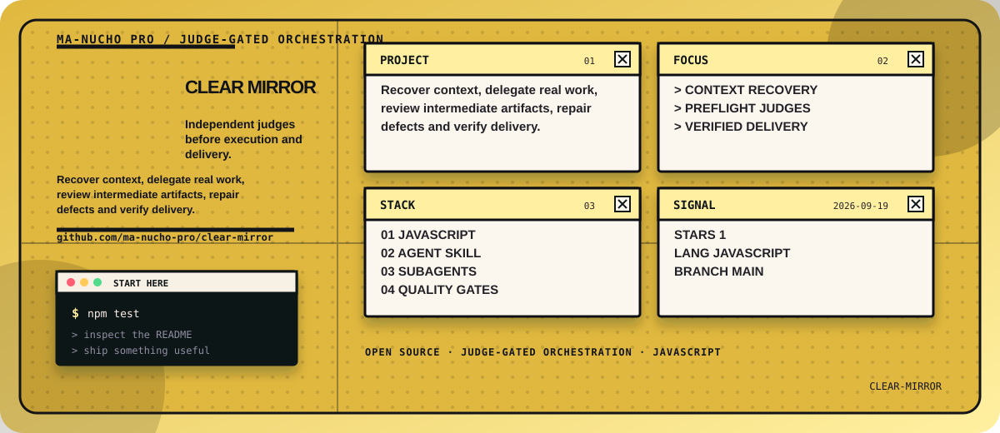
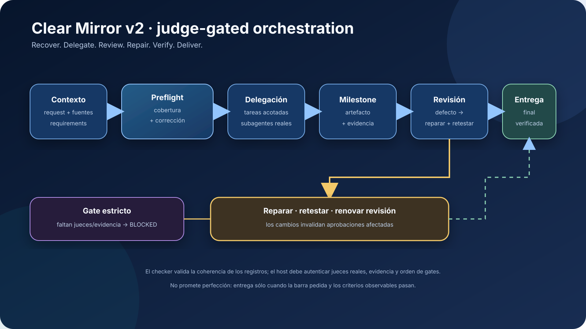
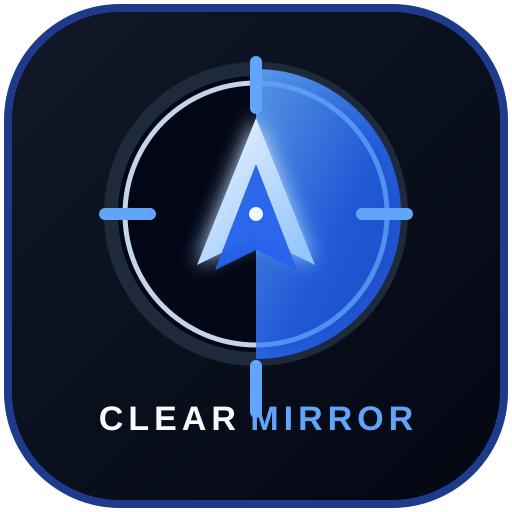

<!-- manucho-readme-banner:start -->
<p align="center">
  
</p>
<!-- manucho-readme-banner:end -->

<p align="center">
  
</p>

<h1 align="center">Clear Mirror</h1>

<p align="center">
  <strong>Independent judges before execution and delivery.</strong>
</p>

<p align="center">
  Recover context. Delegate. Execute. Review. Repair. Verify.
</p>

<p align="center">
  <a href="#what-it-does">What it does</a> ·
  <a href="#install-the-portable-skill">Install</a> ·
  <a href="#supported-harnesses">Harnesses</a> ·
  <a href="#safety-boundaries">Boundaries</a> ·
  <a href="#contributing">Contributing</a>
</p>

<p align="center">
  
  
  
  
  
</p>

Clear Mirror v2 is a portable orchestration skill for work that must be reviewed before execution and before the final answer. It turns a natural-language request into sourced requirements, real delegated work, independent acceptance gates and a repair loop.

```text
request + sources → context/requirements
                 → two preflight judges
                 → delegated execution
                 → correctness + coverage judges
                 → repair / retest / review
                 → final artifact + answer review
                 → delivery
```

<p align="center">
  
</p>

## What it does

- Recovers relevant context and preserves user corrections and constraints.
- Launches independent coverage and correctness judges before artifact creation.
- Splits independent work into bounded tasks using real host subagents.
- Reviews intermediate results before advancing to dependent milestones.
- Resolves defects with evidence, targeted repairs and renewed review.
- Invalidates approvals when reviewed requirements, artifacts or claims change.
- Reviews the final artifact and proposed answer before delivery.
- Requires real judges by default. Missing delegation blocks strict completion; only explicit user authorization permits a qualified single-agent downgrade.

Read [the workflow](skills/clear-mirror/references/orchestration.md) and [judge briefs](skills/clear-mirror/references/roles.md). The supplied universal-context documents informed context recovery, provenance, coverage and correction; [source mapping](skills/clear-mirror/references/source-map.md) identifies the inspected sections.

## What changed from v1

V1 incorrectly narrowed the project to strategic reflection with optional agents. V2 makes judge-gated execution the primary behavior. The earlier reflection method and packet remain optional output formats inside the gates.

Clear Mirror is related to [SupervisorLLM](https://github.com/ma-nucho-pro/supervisorLLM), [supervisorLLM-plugin](https://github.com/ma-nucho-pro/supervisorLLM-plugin), [supervisor-claude-plugin](https://github.com/ma-nucho-pro/supervisor-claude-plugin), [supervisor-skill-claude](https://github.com/ma-nucho-pro/supervisor-skill-claude), [Wonder Woman](https://github.com/ma-nucho-pro/Wonder-Woman) and [Wonder-Woman-Claude-Code](https://github.com/ma-nucho-pro/Wonder-Woman-Claude-Code). Its portable contract coordinates review around the whole requested task. It does not bundle their runtimes or manufacture a fixed tribunal.

## Executable gate

```bash
node skills/clear-mirror/scripts/gate.mjs packet.json
npm test
npm run check
```

The portable checker rejects inconsistent advancement packets: stale reviews/evidence, missing coverage, author self-review, duplicate reviewers, failed criteria, unresolved findings and changed final hashes. See [the exact packet contract](skills/clear-mirror/references/gate-contract.md).

**The checker validates records, not truth.** The host must authenticate actual judge invocations/results, inspect evidence, compute revisions from real content and enforce gate order. The skill is a multi-step host-executed workflow, not a daemon, hidden model API or unbypassable enforcement service. A fabricated internally consistent packet cannot be authenticated by this offline checker.

`/loop` means execute → inspect → repair → review until the requested criteria pass, unless the host genuinely exposes that command. It never means guaranteed perfection or endless polishing.

## Install the portable skill

The portable unit is [`skills/clear-mirror/`](skills/clear-mirror/). Keep `SKILL.md`, `references/`, and `agents/` together.

```text
<your-agent-skills-root>/clear-mirror/SKILL.md
```

For a workspace-local installation, copy the directory into the harness's documented skills directory. For a user-wide installation, use that harness's user skills directory. The reasoning contract is the same; the discovery path is host-specific.

## Supported harnesses

| Harness | Package in this repository | What is native | Honest limitation |
| --- | --- | --- | --- |
| Claude Code | [`platforms/claude-code/clear-mirror/`](platforms/claude-code/clear-mirror/) | Plugin manifest and skill discovery | Hooks/subagents depend on the installed Claude Code version and configuration |
| Cursor | [`platforms/cursor/clear-mirror/`](platforms/cursor/clear-mirror/) | Cursor plugin manifest and skill discovery | Native agents/hooks are optional and host-controlled |
| Gemini CLI | [`platforms/gemini-cli/clear-mirror/`](platforms/gemini-cli/clear-mirror/) | Extension manifest and bundled skill | Gemini extension subagents and hooks are version/preview dependent |
| Codex / ChatGPT desktop | [`platforms/codex/clear-mirror/`](platforms/codex/clear-mirror/) | Codex plugin metadata and skill folder | The host decides whether hooks or independent delegation are available |
| Other Agent Skills hosts | [`skills/clear-mirror/`](skills/clear-mirror/) | Portable `SKILL.md` contract | No native adapter is claimed until the host's format is verified |

The adapters package one canonical skill. They do not pretend that every harness exposes identical lifecycle events or subagent APIs.

### Claude Code

```bash
claude --plugin-dir ./platforms/claude-code/clear-mirror
```

Invoke it explicitly as `/clear-mirror:clear-mirror` when the plugin is loaded, or allow automatic skill discovery.

### Cursor

Install the directory from [`platforms/cursor/clear-mirror/`](platforms/cursor/clear-mirror/) through Cursor's local plugin workflow. The skill can also be copied to a supported `.cursor/skills/` location.

### Gemini CLI

```bash
gemini extensions install ./platforms/gemini-cli/clear-mirror --consent
```

Verify discovery with `/extensions list` and `/skills list` after restarting or reloading the CLI.

### Codex / ChatGPT desktop

Copy [`platforms/codex/clear-mirror/skills/clear-mirror/`](platforms/codex/clear-mirror/skills/clear-mirror/) to the user or workspace Agent Skills directory supported by your Codex installation. The included `.codex-plugin/plugin.json` is metadata for hosts that support the Codex plugin layout; it is not a credential or provider configuration.

## Safety boundaries

Clear Mirror is deliberately candid, not abusive.

- It critiques choices, evidence, reasoning, and observable behavior—not a person's worth or protected traits.
- It does not diagnose mental-health conditions or claim certainty about hidden motives.
- It does not request passwords, API keys, or unnecessary private information.
- It marks missing evidence as `UNVERIFIED` rather than turning confidence into fact.
- It does not claim that a subagent, judge, web search, test, or tool ran unless the host returned evidence.
- For medical, legal, financial, employment, or immediate-safety situations, it helps structure questions and options while directing the user to appropriate qualified support.

Read [`skills/clear-mirror/references/safety-boundaries.md`](skills/clear-mirror/references/safety-boundaries.md) for the complete policy.

## Development and validation

The repository has no runtime npm dependencies and requires Node.js 18.17 or newer.

```bash
npm test
node scripts/validate-package.mjs
```

The validator checks the canonical skill, required references/scripts, adapter manifests, full byte-identical skill copies, logo assets, package metadata, and accidental credential patterns. Tests exercise strict gate rejection cases and retain the v1 reflection-packet checks. These are deterministic package checks, not proof that every host ran real judges.

## Contributing

Open an issue with:

- the harness and version;
- the user request that exposed the problem;
- the observed behavior;
- the smallest reproducible example;
- what a correct response should verify.

Do not include secrets or private transcripts. Pull requests should run `npm test` and preserve the portable core.

## Author

Created by **Roberto Manuel Jara Peche** and released under the MIT license.

GitHub: [@ma-nucho-pro](https://github.com/ma-nucho-pro) ·
Instagram: [@robertmanuchojp](https://www.instagram.com/robertmanuchojp/) ·
YouTube: [@ManuchoAI](https://www.youtube.com/@ManuchoAI) ·
LinkedIn: [Roberto Manuel Jara Peche](https://www.linkedin.com/in/roberto-manuel-jara-peche-10867240b/)

<p align="center">
  
</p>

<p align="center">
  <sub>Clear thinking. Honest feedback. Concrete next steps.</sub>
</p>
