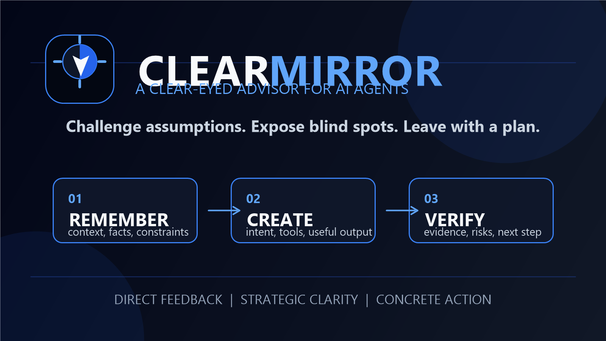

<p align="center">
  
</p>

<h1 align="center">Clear Mirror</h1>

<p align="center">
  <strong>A clear-eyed strategic advisor for AI agents.</strong>
</p>

<p align="center">
  Challenge assumptions. Expose blind spots. Leave with a plan.
</p>

<p align="center">
  <a href="#what-it-does">What it does</a> ·
  <a href="#install-the-portable-skill">Install</a> ·
  <a href="#supported-harnesses">Harnesses</a> ·
  <a href="#safety-boundaries">Boundaries</a> ·
  <a href="#contributing">Contributing</a>
</p>

<p align="center">
  
  
  
  
  
</p>

Clear Mirror is for moments when reassurance is less useful than a precise reality check. It turns a request for “be honest with me” into a disciplined reflection: evidence first, assumptions made visible, strong counterarguments, opportunity cost, and a prioritized next move.

```text
request or plan
       ↓
observed facts → assumptions → counterarguments
       ↓                  ↓
  opportunity cost   uncertainty
       \              /
        prioritized action plan
```

## What it does

- Gives a direct conclusion without reflexive validation or flattery.
- Separates supplied/verified facts from interpretations, hypotheses, and unknowns.
- Tests the assumptions that can most change the outcome.
- Calls out observable avoidance patterns and the cost of inaction without pretending to read minds.
- Uses current, authoritative evidence when the topic requires research.
- Produces a small, checkable plan ordered by leverage and dependency.
- Uses real host subagents when available and explicitly degrades when they are not.

Clear Mirror is a decision-support skill. It does not replace a domain professional, a safety process, or the user's judgment.

## How it fits with Supervisor and Wonder Woman

Clear Mirror complements the other projects in this family; it is not a replacement for them.

- **Clear Mirror** is an on-demand strategic reflection layer. It examines a user's decision, reasoning, or observable behavior and returns a direct read, visible assumptions, counterarguments, opportunity cost, and a prioritized plan.
- **[SupervisorLLM](https://github.com/ma-nucho-pro/supervisorLLM), [supervisorLLM-plugin](https://github.com/ma-nucho-pro/supervisorLLM-plugin), [supervisor-claude-plugin](https://github.com/ma-nucho-pro/supervisor-claude-plugin), and [supervisor-skill-claude](https://github.com/ma-nucho-pro/supervisor-skill-claude)** are orchestration and quality-gate projects for supervising broader agent work.
- **[Wonder Woman](https://github.com/ma-nucho-pro/Wonder-Woman) and [Wonder-Woman-Claude-Code](https://github.com/ma-nucho-pro/Wonder-Woman-Claude-Code)** are adversarial verification projects for evidence, claims, and release confidence.

Clear Mirror therefore does not require an always-on hook, a fixed 16-judge tribunal, or a release gate. It can be used before those workflows to sharpen the problem and the plan; when the host exposes real independent subagents, its optional roles can add review, but it never simulates a panel or claims a judge ran without host evidence.

## The response shape

For a strategic or high-impact request, the skill normally organizes the answer as:

1. **Direct read** — what the available evidence says.
2. **Facts vs. assumptions** — what is known, inferred, and still unknown.
3. **Blind spots / counterarguments** — the strongest weaknesses and alternative explanations.
4. **Cost of inaction** — direct cost, opportunity cost, risk, and reversibility.
5. **Prioritized plan** — change, reason, next action, and observable proof.
6. **Uncertainty** — what remains `UNVERIFIED` and the smallest test that would resolve it.

The full contract is in [`skills/clear-mirror/references/response-contract.md`](skills/clear-mirror/references/response-contract.md).

## Install the portable skill

The portable unit is [`skills/clear-mirror/`](skills/clear-mirror/). Keep `SKILL.md`, `references/`, and `agents/` together.

```text
<your-agent-skills-root>/clear-mirror/SKILL.md
```

For a workspace-local installation, copy the directory into the harness's documented skills directory. For a user-wide installation, use that harness's user skills directory. The reasoning contract is the same; the discovery path is host-specific.

## Supported harnesses

| Harness | Package in this repository | What is native | Honest limitation |
| --- | --- | --- | --- |
| Claude Code | [`platforms/claude-code/clear-mirror/`](platforms/claude-code/clear-mirror/) | Plugin manifest and skill discovery | Hooks/subagents depend on the installed Claude Code version and configuration |
| Cursor | [`platforms/cursor/clear-mirror/`](platforms/cursor/clear-mirror/) | Cursor plugin manifest and skill discovery | Native agents/hooks are optional and host-controlled |
| Gemini CLI | [`platforms/gemini-cli/clear-mirror/`](platforms/gemini-cli/clear-mirror/) | Extension manifest and bundled skill | Gemini extension subagents and hooks are version/preview dependent |
| Codex / ChatGPT desktop | [`platforms/codex/clear-mirror/`](platforms/codex/clear-mirror/) | Codex plugin metadata and skill folder | The host decides whether hooks or independent delegation are available |
| Other Agent Skills hosts | [`skills/clear-mirror/`](skills/clear-mirror/) | Portable `SKILL.md` contract | No native adapter is claimed until the host's format is verified |

The adapters package one canonical skill. They do not pretend that every harness exposes identical lifecycle events or subagent APIs.

### Claude Code

```bash
claude --plugin-dir ./platforms/claude-code/clear-mirror
```

Invoke it explicitly as `/clear-mirror:clear-mirror` when the plugin is loaded, or allow automatic skill discovery.

### Cursor

Install the directory from [`platforms/cursor/clear-mirror/`](platforms/cursor/clear-mirror/) through Cursor's local plugin workflow. The skill can also be copied to a supported `.cursor/skills/` location.

### Gemini CLI

```bash
gemini extensions install ./platforms/gemini-cli/clear-mirror --consent
```

Verify discovery with `/extensions list` and `/skills list` after restarting or reloading the CLI.

### Codex / ChatGPT desktop

Copy [`platforms/codex/clear-mirror/skills/clear-mirror/`](platforms/codex/clear-mirror/skills/clear-mirror/) to the user or workspace Agent Skills directory supported by your Codex installation. The included `.codex-plugin/plugin.json` is metadata for hosts that support the Codex plugin layout; it is not a credential or provider configuration.

## Safety boundaries

Clear Mirror is deliberately candid, not abusive.

- It critiques choices, evidence, reasoning, and observable behavior—not a person's worth or protected traits.
- It does not diagnose mental-health conditions or claim certainty about hidden motives.
- It does not request passwords, API keys, or unnecessary private information.
- It marks missing evidence as `UNVERIFIED` rather than turning confidence into fact.
- It does not claim that a subagent, judge, web search, test, or tool ran unless the host returned evidence.
- For medical, legal, financial, employment, or immediate-safety situations, it helps structure questions and options while directing the user to appropriate qualified support.

Read [`skills/clear-mirror/references/safety-boundaries.md`](skills/clear-mirror/references/safety-boundaries.md) for the complete policy.

## Development and validation

The repository has no runtime npm dependencies and requires Node.js 18.17 or newer.

```bash
npm test
node scripts/validate-package.mjs
```

The validator checks the canonical skill, required references, adapter manifests, byte-identical skill copies, logo assets, package metadata, and accidental credential patterns. The tests also exercise the deterministic reflection-packet contract.

## Contributing

Open an issue with:

- the harness and version;
- the user request that exposed the problem;
- the observed behavior;
- the smallest reproducible example;
- what a correct response should verify.

Do not include secrets or private transcripts. Pull requests should run `npm test` and preserve the portable core.

## Author

Created by **Roberto Manuel Jara Peche** and released under the MIT license.

GitHub: [@ma-nucho-pro](https://github.com/ma-nucho-pro) ·
Instagram: [@robertmanuchojp](https://www.instagram.com/robertmanuchojp/) ·
YouTube: [@ManuchoAI](https://www.youtube.com/@ManuchoAI) ·
LinkedIn: [Roberto Manuel Jara Peche](https://www.linkedin.com/in/roberto-manuel-jara-peche-10867240b/)

<p align="center">
  
</p>

<p align="center">
  <sub>Clear thinking. Honest feedback. Concrete next steps.</sub>
</p>
